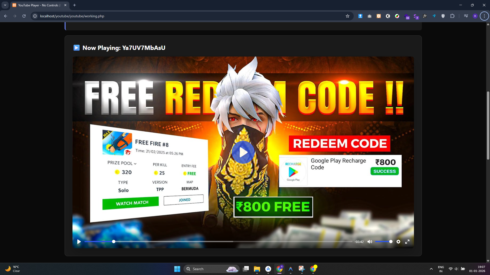
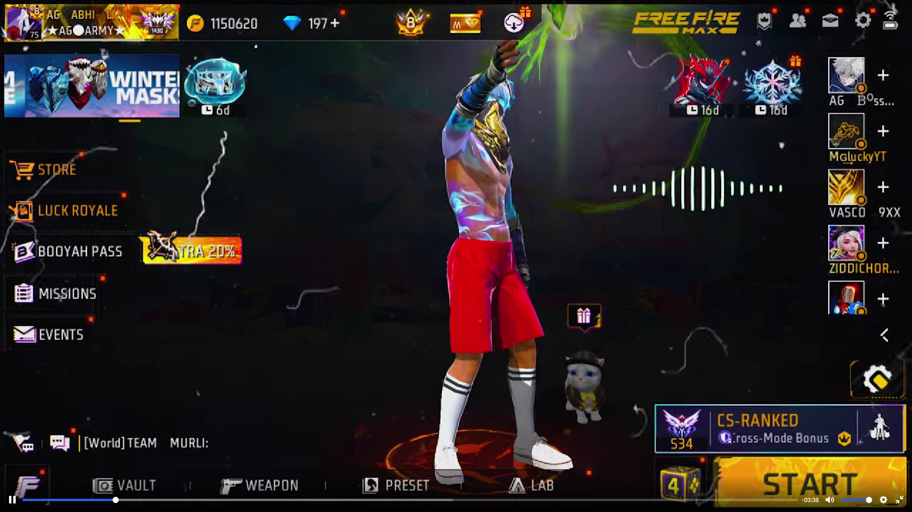
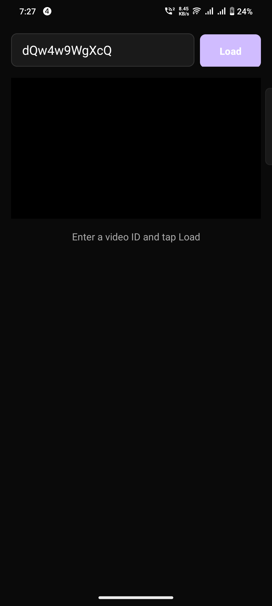
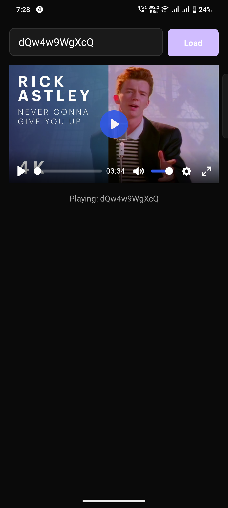
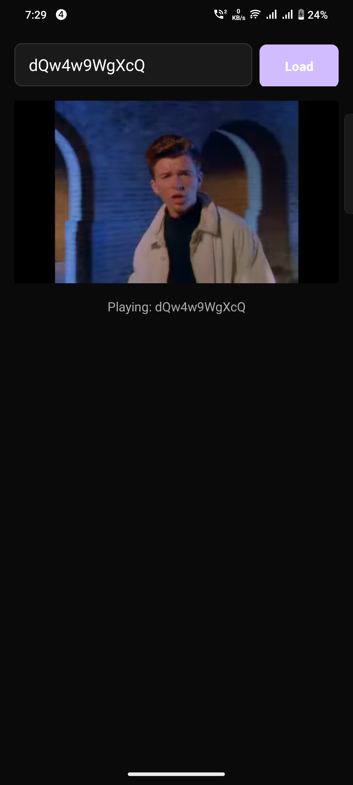

# Arknox Technology YouTube Player Library

A custom Android YouTube player library based on Plyr.js, featuring **branding removal**, **custom controls**, and **privacy-enhanced mode**.

## Features

- 🚫 **Branding Removal**: Removes YouTube logo, title, and related videos.
- 🎨 **Custom Controls**: Uses Plyr.js for a premium, clean interface.
- 📱 **Fullscreen Support**: Immersive fullscreen with auto-landscape rotation.
- 🔒 **Privacy Mode**: Uses `youtube-nocookie.com`.
- ⚡ **Lightweight**: WebView-based implementation.
- 👆 **Click-to-Play**: Tap anywhere to play/pause.

## Installation

### Method 1: Direct from Git (Recommended)

Add easy integration directly from GitHub using JitPack.

**Step 1. Add the JitPack repository**
In your `settings.gradle` (or root `build.gradle`):
```gradle
dependencyResolutionManagement {
    repositories {
        google()
        mavenCentral()
        maven { url 'https://jitpack.io' }
    }
}
```

**Step 2. Add the dependency**
In your app's `build.gradle`:
```gradle
dependencies {
    // Usage with JitPack
    implementation 'com.github.mdakashhossain1:Android-YTPlayer:v1.0.0'
    
    // Required dependency
    implementation 'androidx.webkit:webkit:1.12.1'
}
```

### Method 2: Manual (Local Module)

If you prefer to include the source code directly:

1. Copy the `youtubeplayer` folder to your project.
2. Add to `settings.gradle`: `include ':youtubeplayer'`
3. Add to app `build.gradle`: `implementation project(':youtubeplayer')`

## Usage

### XML Layout

Add `YouTubePlayerView` to your layout:

```xml
<com.arknox.youtube.YouTubePlayerView
    android:id="@+id/youtubePlayerView"
    android:layout_width="match_parent"
    android:layout_height="250dp"
    android:background="#000000" />
```

### AndroidManifest.xml (Important)

To handle orientation changes and fullscreen correctly without reloading the video, add `android:configChanges` to your Activity:

```xml
<activity
    android:name=".YourActivity"
    android:configChanges="orientation|screenSize|screenLayout|keyboardHidden"
    android:hardwareAccelerated="true"
    ... />
```

### Kotlin Implementation

Initialize and control the player in your Activity/Fragment:

```kotlin
class MainActivity : AppCompatActivity() {

    private lateinit var youtubePlayerView: YouTubePlayerView

    override fun onCreate(savedInstanceState: Bundle?) {
        super.onCreate(savedInstanceState)
        setContentView(R.layout.activity_main)

        youtubePlayerView = findViewById(R.id.youtubePlayerView)

        // 1. Load a Video
        youtubePlayerView.loadVideo("dQw4w9WgXcQ") // Use Video ID or URL

        // 2. Add Listener (Optional)
        youtubePlayerView.addListener(object : YouTubePlayerListener {
            override fun onReady(videoId: String) {
                // Player is ready
            }

            override fun onPlaying(videoId: String) {
                // Video started
            }

            override fun onFullscreenChange(isFullscreen: Boolean) {
                // Handle fullscreen change
            }
            
            override fun onError(message: String) {
                // Handle error
            }
        })
    }

    // 3. Handle Back Button for Fullscreen
    override fun onBackPressed() {
        if (youtubePlayerView.isInFullscreen()) {
            youtubePlayerView.exitFullscreen()
        } else {
            super.onBackPressed()
        }
    }

    // 4. Lifecycle Management
    override fun onPause() {
        super.onPause()
        youtubePlayerView.pause()
    }

    override fun onDestroy() {
        youtubePlayerView.release()
        super.onDestroy()
    }
}
```


## Web Library (HTML/JS)

This repository also includes a pure web version of the player that you can use in any HTML/PHP project.

### Installation

1. Copy the contents of the `web-lib` folder to your project:
   - `plyr.js` & `plyr.css` (Core library)
   - `script.js` & `style.css` (Custom logic and styling)
   - `plyr.svg` (Icons)

### Usage

1. **Include CSS**:
   ```html
   <link rel="stylesheet" href="plyr.css" />
   <link rel="stylesheet" href="style.css" />
   ```

2. **Add Player Container**:
   ```html
   <div class="player-wrapper">
       <!-- Native Plyr container -->
       <div id="player" data-plyr-provider="youtube" data-plyr-embed-id="dQw4w9WgXcQ"></div>
   </div>
   ```

3. **Include JS**:
   ```html
   <script src="plyr.js"></script>
   <script src="script.js"></script>
   ```

4. **Control via JavaScript**:
   ```javascript
   // Load new video
   loadVideo('dQw4w9WgXcQ');

   // Change color
   changePlayerColor('#ff0000');
   ```

### Screenshots

### App Screenshots









## License

This project is licensed under the MIT License - see the [LICENSE](LICENSE) file for details.
Copyright (c) 2026 Arknox Technology
